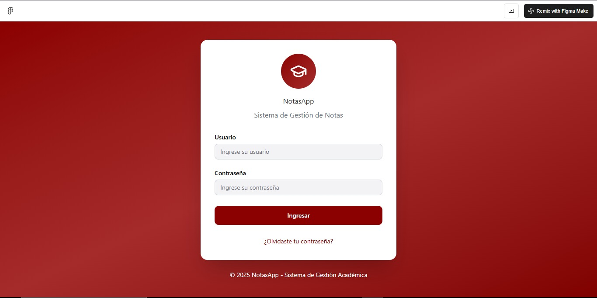

# 📝 Gestor de Notas

[✨ Ver mi diseño en Figma](https://crow-ginger-32087637.figma.site)


## 🚀 Resumen corto

Proyecto web para gestionar notas (**crear**, **editar**, **eliminar** y **listar** notas) desarrollado con **PHP**, **JavaScript** y **CSS**.

---

## 📁 Estructura / disposición del proyecto

Explicación general de la estructura de carpetas (ajusta rutas si difieren en el repo):

* `/` — Raíz del proyecto
    * `README.md`
    * `index.php` — Página principal / controlador frontal (si aplica)
* `/app` — Lógica de la aplicación (controladores, modelos)
    * `/controllers`
    * `/models`
    * `/views`
* `/public` — Archivos públicos accesibles (si aplicable)
    * `/css`
    * `/js`
    * `/images`
* `/config` — Configuraciones (base de datos, constantes)
* `/database` — Scripts SQL para crear tablas / migraiones
* `/vendor` — Dependencias (si aplica, composer)
* `.htaccess` — Reglas de Apache (si se usa)

> **Nota:** Ajusta las rutas anteriores para reflejar exactamente la estructura de tu repo.

---

## ✅ Funcionalidades

Lista de funcionalidades principales:

* **Crear notas** (título, contenido, fecha) ➕
* **Editar notas** existentes ✏️
* **Eliminar notas** 🗑️
* **Listar todas las notas** 📋
* **Buscar notas** por título o contenido (si está implementado) 🔎
* **Ordenar notas** (por fecha, título) ↕️
* Validación básica en el **frontend** y **backend**
* Interfaz **responsiva** básica (si CSS incluye estilos responsivos) 📱

---

## 🏗️ Arquitectura usada

Descripción de la arquitectura (ejemplo **MVC**):

| Aspecto | Descripción |
| :--- | :--- |
| **Patrón** | **MVC** (Model — View — Controller) |
| **Model** | Interacción con la base de datos (**CRUD** para notas) |
| **View** | Plantillas y páginas HTML/CSS/JS que muestran la UI |
| **Controller** | Recibe peticiones del usuario, invoca modelos y devuelve vistas |
| **Base de datos** | **MySQL** (tablas simples para notas) |
| **Servidor** | **Apache** a través de **XAMPP** (o cualquier servidor LAMP) |

---

## 💻 Tecnologías usadas (con enlaces)

* **PHP** — Lenguaje de servidor. [Documentación](https://www.php.net/)
* **MySQL** — Sistema de gestión de bases de datos relacional. [Documentación](https://dev.mysql.com/doc/)
* **Apache** — Servidor web (incluido en XAMPP). [Documentación](https://httpd.apache.org/)
* **XAMPP** — Paquete para desarrollo local (Apache, MySQL, PHP). [Página oficial](https://www.apachefriends.org/es/index.html)
* **JavaScript** — Interactividad en el cliente. [Documentación MDN](https://developer.mozilla.org/es/docs/Web/JavaScript)
* **CSS** — Estilos. [Documentación MDN](https://developer.mozilla.org/es/docs/Web/CSS)
* (Opcional) **Composer** — Gestor de dependencias PHP. [Página oficial](https://getcomposer.org/)
* (Opcional) **Bootstrap** — Framework CSS para diseño responsivo. [Página oficial](https://getbootstrap.com/)

---

## ⚙️ Instalación y cómo correr el proyecto con XAMPP (paso a paso)

A continuación se asume que el proyecto usa **PHP + MySQL** y que tienes **XAMPP instalado en Windows**.

### 1. Instala XAMPP

* Descarga e instala XAMPP desde [https://www.apachefriends.org/es/index.html](https://www.apachefriends.org/es/index.html)
* Asegúrate de incluir **Apache** y **MySQL (MariaDB)** durante la instalación.

### 2. Copia los archivos al directorio de XAMPP

* Carpeta típica en Windows: `C:\xampp\htdocs\`
* Crea una carpeta para el proyecto, por ejemplo: `C:\xampp\htdocs\gestor_de_Notas\`
* Copia el contenido del repo a esa carpeta.

### 3. Configura la base de datos

* Inicia **XAMPP Control Panel** y arranca **Apache** y **MySQL**.
* Abre **phpMyAdmin**: `http://localhost/phpmyadmin/`
* Crea una nueva base de datos, por ejemplo: `gestor_de_notas`
* **Importa el script SQL** (si existe un archivo en `/database/schema.sql` o similar):
    * En phpMyAdmin ve a la base de datos -> Importar -> Selecciona el archivo SQL -> Ejecutar.
* Si no hay script, **crea manualmente la tabla de notas** (ejemplo SQL):

    ```sql
    CREATE TABLE notas ( 
        id INT AUTO_INCREMENT PRIMARY KEY, 
        titulo VARCHAR(255) NOT NULL, 
        contenido TEXT, 
        fecha_creacion DATETIME DEFAULT CURRENT_TIMESTAMP 
    );
    ```

### 4. Configura los datos de conexión (`config`)

* Abre el archivo de configuración de base de datos en tu proyecto (por ejemplo `/config/db.php` o `/app/config.php`).
* Ajusta los parámetros:
    * `host`: `localhost`
    * `usuario`: `root`
    * `contraseña`: (por defecto en XAMPP es vacía) `''`
    * `nombre de la base de datos`: `gestor_de_notas`

* **Ejemplo de configuración simple en PHP:**
    ```php
    <?php 
    $db_host = '127.0.0.1'; 
    $db_user = 'root'; 
    $db_pass = ''; 
    $db_name = 'gestor_de_notas'; 
    $mysqli = new mysqli($db_host, $db_user, $db_pass, $db_name); 
    if ($mysqli->connect_error) { 
        die('Error de conexión (' . $mysqli->connect_errno . ') ' . $mysqli->connect_error); 
    }
    ```

### 5. Reglas de Apache / `.htaccess` (si aplica)

* Si usas **rutas amigables**, verifica que el archivo `.htaccess` esté presente en la carpeta del proyecto.

### 6. Accede a la aplicación

* Abre en tu navegador: `http://localhost/gestor_de_Notas/` (o la carpeta que hayas usado)
* Deberías ver la página principal y poder crear, listar y editar notas.

---

## 🐞 Errores comunes y cómo depurarlos

* **Página en blanco / errores PHP:**
    * Habilita la visualización de errores: en `php.ini` set `display_errors = On` y `error_reporting = E_ALL`, o agrega al inicio del `index.php`:
        ```php
        ini_set('display_errors', 1); 
        ini_set('display_startup_errors', 1); 
        error_reporting(E_ALL);
        ```
* **Problemas de conexión con la DB:**
    * Revisa credenciales, host y que **MySQL esté corriendo** en XAMPP.
* **Problemas con rutas de CSS/JS:**
    * Verifica que las **rutas relativas** sean correctas con la ubicación en `htdocs`.
* **Permisos:**
    * Asegúrate de que los archivos tengan **permisos de lectura/ejecución** adecuados (especialmente en Linux/macOS).

---

## ✨ Consejos de desarrollo

* Usa **Composer** si tu proyecto tiene dependencias en PHP.
* Mantén las credenciales fuera del repo (usa **.env** o config local ignorado por **.gitignore**).
* Añade un archivo `database/schema.sql` con la estructura de tablas y/o migraciones.
* Incluir instrucciones para pruebas (si aplica).

---

## 🤝 Cómo contribuir

* **Fork** → **branch** feature → **PR** con descripción clara
* Ejecutar pruebas localmente (si existen)
* Añadir issues para bugs o mejoras 🐛

---

## 📜 Licencia

Indica la licencia que prefieras (ejemplo **MIT**).

---

## ✉️ Contacto

* **Autor:** `@SantOchoa`
* **Autor:** `@JERG_YT`
* **Autor:** `@lsmartinez23`

