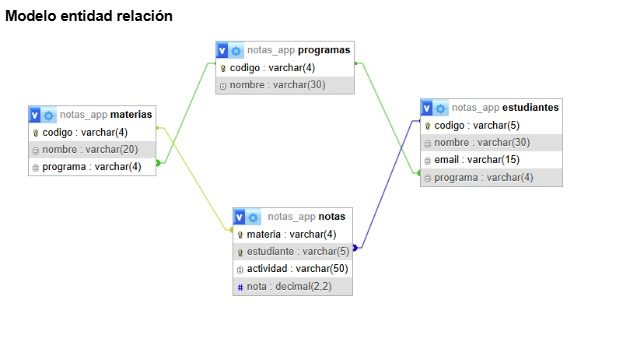

Se requiere desarrollar una aplicación que permita gestionar las notas de las materias de estudiantes. La aplicación debe realizar las siguientes funcionalidades.

- [x] Se debe consultar, registrar, modificar y eliminar la información de los estudiantes.  
- [x] La información que se debe guardar del estudiante es: código, nombre, correo electrónico y programa de formación.  
- [-] Se puede modificar la información del estudiante menos el código y siempre que el usuario no tenga notas registradas. De lo contrario no se puede modificar.  
- [-] Se puede eliminar un estudiante siempre que no tenga notas registradas. De lo contrario no se puede eliminar.  
    
- [x] El sistema debe poder consultar, crear, modificar y eliminar programas de formación.  
- [x] La información que se debe guardar del programa de formación es: código y nombre.  
- [-] Se puede modificar solo el nombre de un programa de formación y siempre que este no este relacionado a estudiantes o materias. De lo contrario no se puede modificar.  
- [x] Un programa de formación puede tener relacionado varios estudiantes y varias materias.  
- [-] Se puede eliminar un programa de formación siempre que no tenga materias o estudiantes relacionados. De lo contrario no se puede eliminar.  
    
- [x] Se debe consultar, registrar, modificar y eliminar la información de las materias asociadas a un programa de formación.  
- [x] La información que se debe guardar de la materia es: código, nombre y programa de formación.  
- [-] Se puede modificar la información de la materia menos el código y siempre que no tenga notas registradas o estudiantes relacionados. De lo contrario no se puede modificar.  
- [-] Se puede eliminar una materia siempre que no tenga notas registradas o estudiantes relacionados. De lo contrario no se puede eliminar.

- [x] Se debe consultar, registrar, modificar y eliminar la información de las notas de un estudiante.  
- [x] La información que se debe guardar de la nota es: estudiante, materia y la nota. La nota debe ser un número mayor a cero y menor a 5\. Solo puede recibir máximo dos decimales.  
- [x] Se puede cambiar la nota de un estudiante, pero solo la nota.  
- [x] Se pueden eliminar las notas de un estudiante.  
  Un estudiante puede tener varias notas en una materia. por lo que la nota definitiva debe ser el promedio de las notas registradas. Si no hay notas el promedio debe ser cero. El promedio debe tener máximo dos decimales.  
- [x] Las notas solo se registran a materias registradas al programa, no se puede registrar notas de materias que no estén en el programa.  
    
- [x] Se debe visualizar los programas de formación registrados.  
- [-] Se debe visualizar todas las materias registradas por programa de formación.  
- [x] Se debe visualizar todos los estudiantes registrados en un programa de formación.  
- [x] Se debe visualizar todos los estudiantes registrados por materia junto con su nota promedio en cada materia..  
- [x] Se debe visualizar todas las materias registradas a un estudiante junto con su nota promedio.  
- [x] Se debe visualizar todas las notas registradas de un estudiante por materia.  
- [x] Todas las operaciones de eliminación deben tener una confirmación de continuar o no en el proceso. Si el usuario continua se procede a eliminar de lo contrario no.  
- [x] **El usuario puede navegar en cualquier momento a cualquier funcionalidad, no va a interactuar con la base de datos directamente, por lo que se recomienda que las interfaces deben ser fáciles de usar frente al usuario.**  
    
- [x] Se debe crear un proyecto usando POO, MVC con php, html y css (opcional js).  
- [x] La entrega debe hacerse en un repositorio en Github.

